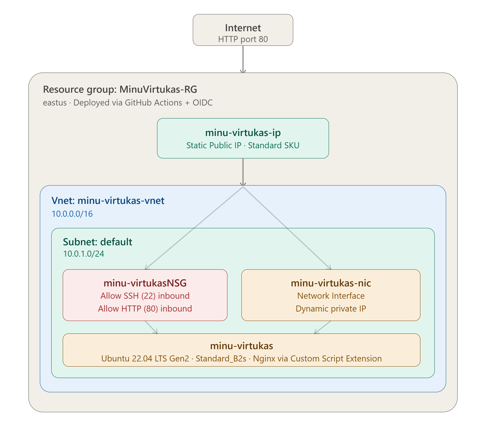

# Lab 01: Automated Nginx Deployment

Deploy Linux VM with Nginx installed automatically on startup: No manual configuration, no portal. Push to GitHub and the infrastructure deploys itself.

## Architecture

## What this deploys

| Resource | Name | Purpose |
|----------|------|---------|
| Public IP | minu-virtukas-ip | Static public IP for the VM |
| Network Security Group | minu-virtukasNSG | Allow SSH (22) and HTTP (80) inbound |
| Virtual Network | minu-virtukas-vnet | Private network (10.0.0.0/16) with subnet 10.0.1.0/24 |
| Network Interface | minu-virtukas-nic | Connects VM to VNet and public IP |
| Linux VM | minu-virtukas | Ubuntu 22.04 LTS Gen2, Standard_B2s |
| VM Extension | customScript | Installs Nginx and deploys a custom HTML page on startup |

## Tech stack

| Layer | Technology |
|-------|-----------|
| IaC | Bicep |
| Automation | GitHub Actions |
| Security | OIDC (Federated Credentials) = no stored passwords |
| OS | Ubuntu 22.04 LTS Gen2 |
| Web server | Nginx (auto-installed via Custom Script Extension) |

## How to run

> The "Run Workflow" button is only visible to me as the owner. To test this yourself, fork this repository and add your own `AZURE_CREDENTIALS` secret.

1. Go to the Actions tab
2. Select Deploy Lab 01
3. Click Run Workflow and choose your target region

## Project links

- [Code](./main.bicep)
- [Workflow](../../.github/workflows/deploy-lab01.yml)
