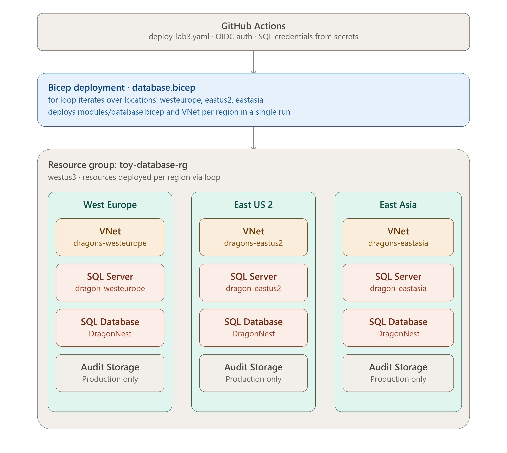

# Lab 04: Multi-Region Database Deployment

Deploy Azure SQL databases and virtual networks across multiple regions simultaneously using Bicep loops: Single template that provisions the same infrastructure in West Europe, East US 2, and East Asia in one deployment.

## Architecture

## What this deploys

Deployed across three regions simultaneously: `westeurope`, `eastus2`, `eastasia`

**Per region (via module loop):**

| Resource | Name | Purpose |
|----------|------|---------|
| SQL Server | dragon{location}{unique} | Azure SQL Server instance |
| SQL Database | DragonNest | Standard tier database |
| Storage Account | bearaudit{location}{unique} | Audit log storage: Production only |
| Audit Settings | default | SQL auditing: Production only |

**Per region (main template):**

| Resource | Name | Purpose |
|----------|------|---------|
| Virtual Network | dragons-{location} | 10.10.0.0/16 with frontend and backend subnets |

**Environment-aware behaviour:**

| Environment | Auditing | Audit Storage |
|-------------|----------|--------------|
| Development | Disabled | Not created |
| Production | Enabled | Created with LRS storage |

## Tech stack

| Layer | Technology |
|-------|-----------|
| IaC | Bicep with modules and loops |
| Automation | GitHub Actions |
| Authentication | OIDC (Federated Credentials) |
| Pattern | Bicep `for` loops for multi-region deployment from a single template |

## How to run

> The "Run Workflow" button is only visible to me as the owner. To test this yourself, fork this repository and add your own `AZURE_CREDENTIALS`, `SQL_ADMIN_LOGIN`, and `SQL_PASSWORD` secrets.

1. Go to the Actions tab
2. Select Deploy Lab 3 - Database
3. Click Run Workflow

The workflow deploys to `toy-database-rg` in `westus3`. SQL admin credentials are pulled from GitHub secrets.

## Project links

- [Main template](./database.bicep)
- [Database module](./modules/database.bicep)
- [Workflow](../../.github/workflows/deploy-lab3.yaml)