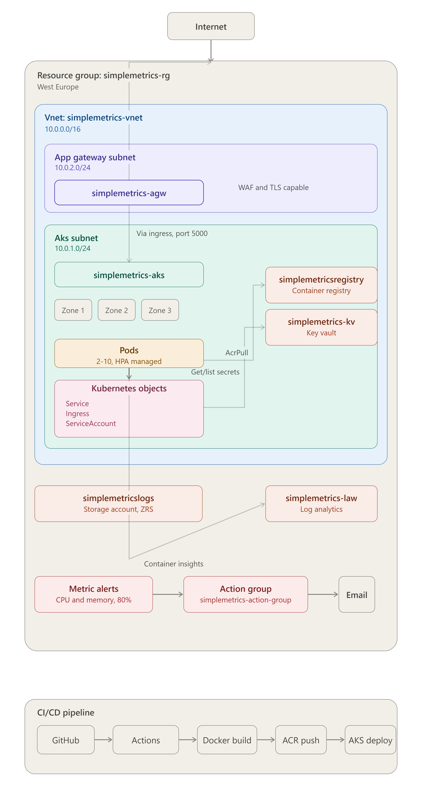
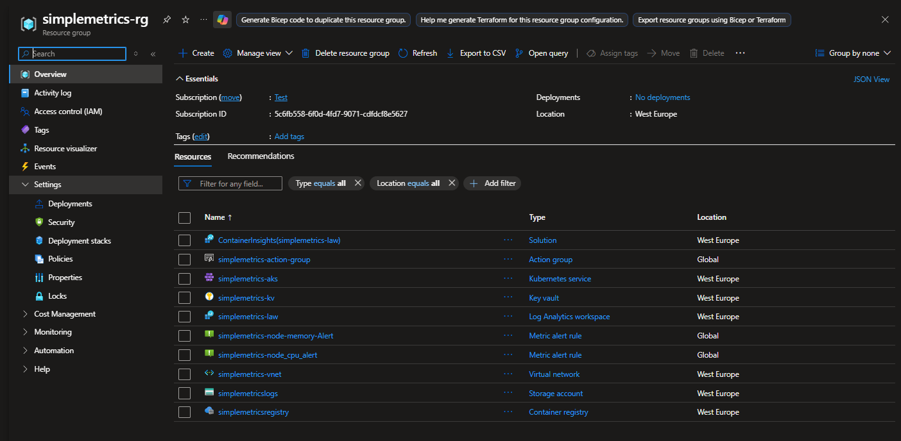
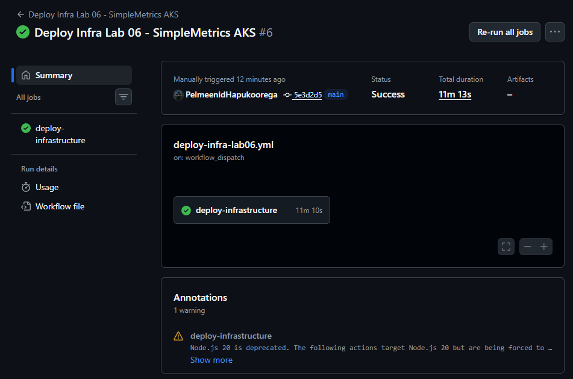
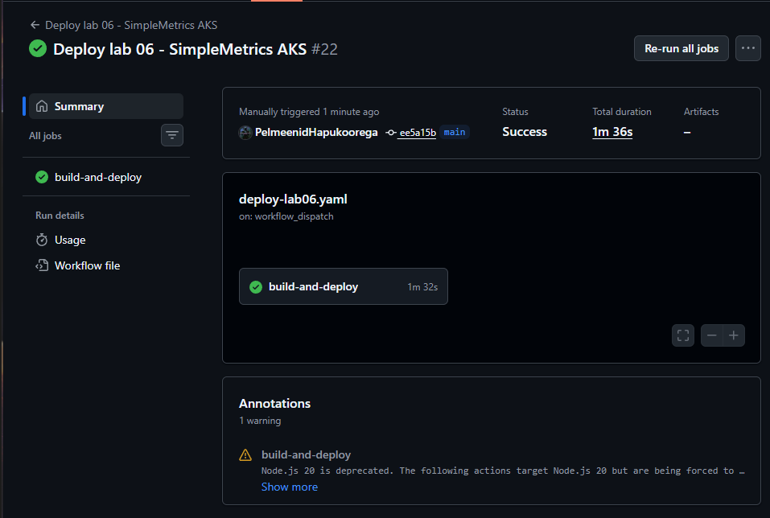
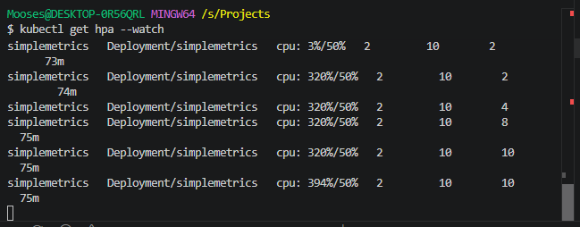
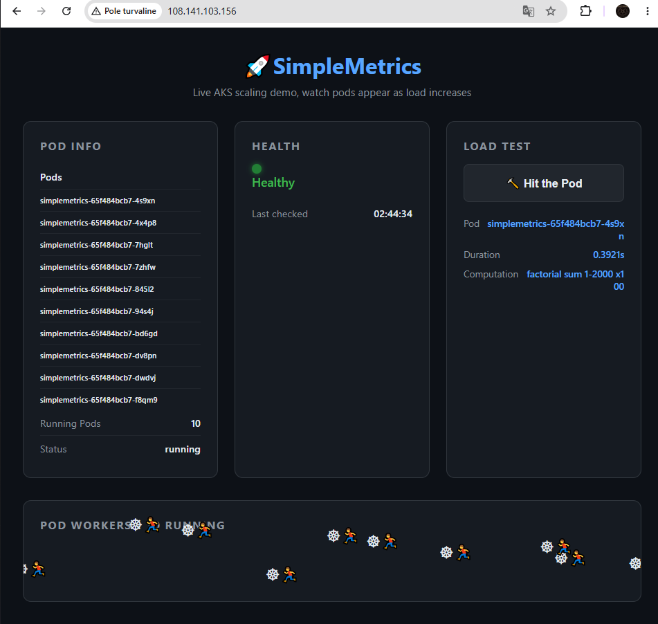

# Lab 06: SimpleMetrics AKS

This project was me trying my hand at AKS. 

The purpose of it was to use AKS to deploy my app to the web and then load test it to see cluster autoscale work in real time, with the addition of getting information about the pods, their health, names etc.

## Architecture



## Live demo evidence

**Infrastructure deployed in Azure:**



**CI/CD pipeline: infrastructure deploy:**



**CI/CD pipeline: app build and deploy:**



**HPA scaling under load: CPU at 394%, scaling 2 → 10 pods:**



**App at peak load: 10 pods running, all visible in UI:**



## What this deploys

### Azure Infrastructure

| Resource | Name | Purpose |
|----------|------|---------|
| Resource Group | simplemetrics-rg | Container for all resources |
| Virtual Network | simplemetrics-vnet | 10.0.0.0/16 with workload subnet 10.0.1.0/24 |
| AKS Cluster | simplemetrics-aks | Kubernetes cluster across zones 1, 2, 3 |
| Container Registry | simplemetricsregistry | Stores the Docker image |
| Application Gateway | simplemetrics-agw | Public-facing ingress, WAF and TLS capable |
| Key Vault | simplemetrics-kv | Secrets management |
| Log Analytics Workspace | simplemetrics-law | Centralised log collection and querying |
| Storage Account | simplemetricslogs | Longterm log archival (ZRS) |

### Monitoring

| Resource | Name | Purpose |
|----------|------|---------|
| Metric Alert | node-cpu-alert | Fires when node CPU exceeds 80% |
| Metric Alert | node-memory-alert | Fires when node memory exceeds 80% |
| Action Group | simplemetrics-action-group | Email notification on alert |
| Container Insights | ContainerInsights(simplemetrics-law) | AKS telemetry into Log Analytics |

### Kubernetes Resources

| Resource | Name | Purpose |
|----------|------|---------|
| Deployment | simplemetrics | Runs the Flask app: min 2, max 10 pods |
| Service | simplemetrics | Routes traffic to pods (ClusterIP) |
| Ingress | simplemetrics | Exposes app via Application Gateway |
| HPA | simplemetrics | Scales pods when CPU exceeds 50% |
| ServiceAccount | simplemetrics | Allows app to query Kubernetes API |

## Tech stack

| Layer | Technology |
|-------|-----------|
| App | Python Flask |
| Containerisation | Docker |
| Registry | Azure Container Registry |
| Orchestration | Azure Kubernetes Service |
| Ingress | Azure Application Gateway (AGIC addon) |
| IaC | Terraform (HCL) |
| CI/CD | GitHub Actions (3 workflows) |
| Monitoring | Azure Monitor, Log Analytics, Container Insights |
| Secrets | Azure Key Vault |
| State management | Terraform remote state: Blob Storage |

## Architecture decisions

**AKS over a simple VM** 

I chose AKS because i wanted to use it for ease of scale. If my app were to be under heavy load it would then scale quickly to catch up. VM alone would require manual intervention while AKS handles it automatically through the HPA (Horizontal pod autoscaler).

**Application Gateway over basic LoadBalancer** 

Considering that i was dealing with a web app specifically, and Application Gateway supports TLS termination and WAF and is specifically designed to load balance traffic between web and internal resources then it seemed like the better choice. A basic LoadBalancer works but doesnt give you that layer of control that was needed in this case.

**ZRS storage** 

Wanted the storage to be available in case a datacenter had failed. ZRS replicates across availability zones so even if one zone goes down the logs and data are still there. Matches the zone-redundant AKS deployment.

**Remote Terraform state** 

Without remote state the GitHub Actions pipeline runs on a fresh machine every time and has no memory of what was deployed and  `terraform destroy` would do nothing. By storing state in Blob storage instead meant that both local and pipeline now shared the same source of truth.

**Three separate workflows** 

One for the infrastructure itself. Second for the image and app, which triggers automatically on every push to the app code. And a third one that kills everything, because manual teardown would take too long and id forget resources running and billing.

**Service principal over admin credentials** 

I wouldnt have to run commands after every deployment. Service principal handles itself, also using a service principal let me assign specific roles necessary for automation, for example: AcrPush for the pipeline to push images, User Access Administrator to create role assignments, Storage Blob Data Contributor for Terraform state access.

**Availability zones** 

AKS nodes spread across zones 1, 2, and 3 in West Europe. If one zone goes down the other two keep running. Same reasoning applied to ZRS storage: consistent availability design across the whole architecture which i picked up when i studied for AZ-104

## CI/CD pipeline

Three GitHub Actions workflows handle the full lifecycle:

| Workflow | Trigger | What it does |
|----------|---------|--------------|
| `deploy-infra-lab06.yml` | Manual | Runs `terraform apply`: provisions all Azure infrastructure |
| `deploy-lab06.yml` | Auto on push to `app/**` or `manifests/**` | Builds Docker image, pushes to ACR, deploys to AKS, verifies rollout |
| `destroy-lab06.yml` | Manual | Removes Kubernetes resources, runs `terraform destroy` |

Images are tagged with the Git commit SHA (`github.sha`) rather than `latest` which ensures Kubernetes always pulls the exact new image and allows rollback to any previous commit.

## RBAC and role assignments

Getting the permissions right was one of the more complex parts of this project. Azure RBAC and Kubernetes RBAC are two separate systems that both needed to be configured.

**Azure RBAC: service principal:**

| Role | Scope | Why |
|------|-------|-----|
| Contributor | Subscription | Create and manage all resources |
| User Access Administrator | Subscription | Create role assignments (needed for AcrPull and AGIC) |
| AcrPush | ACR | Pipeline can push Docker images |
| Storage Blob Data Contributor | State storage account | Terraform reads/writes state via Azure AD auth |

**Azure RBAC,  AKS identities (via Terraform):**

| Role | Identity | Why |
|------|----------|-----|
| AcrPull | AKS kubelet identity | Nodes can pull images from ACR without storing credentials |
| Contributor | AGIC identity on RG | Application Gateway Ingress Controller can configure the gateway |

**Key Vault access policies:**

| Identity | Permissions | Why |
|----------|-------------|-----|
| AKS kubelet | Get, List | Read secrets only = least privilege |
| Current user | Get, List, Set, Delete, Purge | Full management for adding secrets |

**Kubernetes RBAC:**
- ServiceAccount `simplemetrics` created in the `default` namespace
- Role with `get` and `list` on pods
- RoleBinding connecting the ServiceAccount to the Role
- Allows the Flask app to query the Kubernetes API for live pod count from inside the cluster

## Known limitations and what's next

I would make the website secure with HTTPS, add a WAF layer using the Application Gateway, and perhaps create a system-assigned identity that would manage everything else.

| Limitation | Production fix | Why skipped |
|------------|---------------|-------------|
| HTTP only, no HTTPS | TLS certificate via cert-manager + HTTPS listener on App Gateway | Requires domain name and certificate management |
| No WAF | Enable WAF_v2 tier on Application Gateway | ~€250/month: cost prohibitive for a lab |
| /load endpoint open to internet | Rate limiting + authentication | Out of scope for infrastructure demo |
| No DDoS protection | Azure DDoS Protection Standard | ~€2,500/month: enterprise only |
| IP changes on redeploy | Static public IP + custom domain with DNS | AGIC addon doesnt support static IP assignment directly |
| Pod-to-pod traffic unencrypted | mTLS via service mesh (Istio/Linkerd) | Significant complexity for lab context |

I intentionally prioritised demonstrating AKS autoscaling, CI/CD automation, and observability over production hardening. The architecture is designed to be extended.

## What I learned

AKS is very complex. If i zoom out this project is fairly simple but configuring it all honestly takes the cake.

**RBAC and role assignments** 

Genuinely had no idea why i needed to add roles at all, felt like unnecessary extra steps. Eventually clicked that every automated action needs an identity and every identity needs explicit permission, nothing is just allowed by default in Azure. I knew about identities and managed identities before but never got the chance to implement them properly until now.

**Terraform state and the pipeline** 

Destroy pipeline did nothing the first few times, Terraform was running but not touching anything in Azure. Turns out the pipeline spins up a fresh machine every time with no state file so Terraform had no memory of what it built. Had no clue that was even a thing until i hit it.

**The zombie resource group** 

At one point a resource group showed up in `az group show` but `az group delete` said it didnt exist. Portal showed it clicking it said resource not found. Azure was just in some weird contradictory state, no fix, just had to wait it out.

**AGIC not getting an IP** 

Ingress sat there with no IP for ages. Turned out the Application Gateway was stopped, AGIC pod was crash looping because of missing permissions AND it needed a specific backend port annotation to route traffic. Three separate issues that looked like one.

**The Podrick bug** 

After all the infra was working the pod name showed as "unknown". Spent awhile tracing it, turned out the env variable was being read as `os.environ.get("Podrick")` instead of `os.environ.get("POD_NAME")`. Typo from early in the build that survived all the way to prod.

**Gen 1 vs Gen 2** 

Same as Lab 05, VM size is Gen 2 but default image SKU is Gen 1. Not something youd know upfront just errors on apply and you fix it.

## How to deploy

**Prerequisites:** Terraform >= 1.5.0, Azure CLI, kubectl, Docker

**Required GitHub secrets:**

| Secret | Value |
|--------|-------|
| `AZURE_CREDENTIALS` | Service principal JSON |
| `AZURE_SUBSCRIPTION_ID` | Your subscription ID |
| `AZURE_CLIENT_ID` | Service principal client ID |
| `AZURE_CLIENT_SECRET` | Service principal secret |
| `AZURE_STORAGE_ACCESS_KEY` | Terraform state storage key |

**1. Deploy infrastructure**: manual trigger

GitHub Actions → Deploy Infra Lab 06 → Run workflow

**2. Refresh local kubectl credentials**: run after every infrastructure deploy

```bash
az aks get-credentials --name simplemetrics-aks --resource-group simplemetrics-rg --overwrite-existing
```

**3. Deploy app**: triggers automatically on push to `app/**` or `manifests/**`, or manually via GitHub Actions → Deploy Lab 06 → Run workflow

**4. Destroy everything**: manual trigger

GitHub Actions → Destroy Lab 06 → Run workflow

## Useful commands

```bash
# Get ingress IP
kubectl get ingress

# Watch pods
kubectl get pods --watch

# Watch HPA scaling in real time
kubectl get hpa --watch

# Check pod logs
kubectl logs <pod-name> --tail=50

# Describe ingress (debug routing issues)
kubectl describe ingress simplemetrics

# Run load test from terminal
while true; do curl -s http://<INGRESS_IP>/load > /dev/null; done

# Refresh local kubectl credentials after infrastructure deploy
az aks get-credentials --name simplemetrics-aks --resource-group simplemetrics-rg --overwrite-existing

# Check Application Gateway status
az network application-gateway show \
  --name simplemetrics-agw \
  --resource-group MC_simplemetrics-rg_simplemetrics-aks_westeurope \
  --query "{Name:name,State:operationalState}" \
  --output table

# Start Application Gateway if stopped
az network application-gateway start \
  --name simplemetrics-agw \
  --resource-group MC_simplemetrics-rg_simplemetrics-aks_westeurope
```

## Project links

- [Code](./)
- [App](./app/)
- [Terraform](./terraform/)
- [Manifests](./manifests/)
- [Workflows](../../.github/workflows/)
