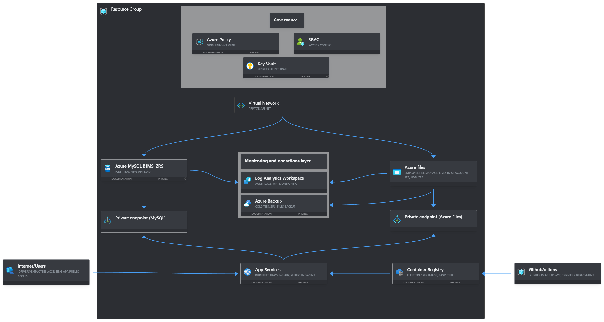

# Scenario: Cloud Infrastructure Modernisation

## Company background

Logistika OÜ is a mid-sized Estonian logistics company based in Tallinn with 180 employees. They operate a fleet of 60 delivery vehicles across Estonia and have partnerships with carriers in Latvia and Lithuania. Their annual revenue is approximately €8 million.

Currently they run everything on-premise — two physical servers in a server room at their Tallinn office, a Windows Server 2016 domain controller, a Linux server running their custom fleet tracking web application (PHP, MySQL), and a NAS for file storage. Their IT is managed by one person who is leaving in two months.

They were recently audited and received a non-compliance notice for GDPR — specifically around data retention, access logging, and backup practices. They have 90 days to remediate.

## Current problems

- Single point of failure — if either server goes down, operations stop
- No offsite backup — the NAS is in the same room as the servers
- No access logging — they cannot prove who accessed what data
- The fleet tracking app has no monitoring — they find out it's down when drivers call
- The IT person manages everything manually — no automation, no documentation
- VPN access to internal systems is via an old Cisco router that nobody knows how to configure anymore

## What they want

1. Fleet tracking application migrated to Azure and containerised if possible
2. All employee file storage moved to Azure
3. Proper backup with offsite retention
4. Access control — only the right people can access the right things
5. Remote management without needing to be on-site
6. Monitoring so they know about problems before drivers do
7. GDPR compliance remediated — audit logs, data retention policies, encryption at rest
8. A pipeline so future application updates don't require manual server access

## Constraints

- Budget: €800/month maximum
- GDPR remediation must be done within 90 days
- New IT person has basic Azure knowledge but no DevOps experience
- Fleet tracking app cannot be down for more than 2 hours during migration
- Data must remain within the EU
- Drivers use the tracking app on mobile — must be publicly accessible

---

# Architecture and decisions made

After reading through the scenario, the first 3 main decision that came to mind were the following:

**Containerisation VS Lift and shift**

I noticed the brief explicitly stated that they wanted the app itself containerised if possible. The 2 decisions i cycled between at the start was lift and shift vs containerisation. I instinctively opted for containerisation over lift and shift because lift and shift would just replicate the same manual server management problem they already had, so that was instantly out of the questions and since i knew that azure has containerisation services like ACR, ACI, ACA and App service.

Eventually i opted to use ACR for storing and managing the container image and have the App service then run it.

ACR specifically is designed for storing and management of the containerized images, so all i needed was to write a dockerfile to instruct it how to install the fleet tracker app which then bakes the app and its dependencies all together, then i could push it to the ACR and have App service run it.

Now you may wonder why not use ACI or ACA over app service?

* ACI

With ACI the problem is that it has no pipeline integration, it restarts from scratch if it crashes which causes downtime. Mostly its purpose is for just one off tasks so basically quikcly have it run some minute task and done.

* ACA

Now with ACA we are dealing with fully managed, has built in autoscaling which is great when traffic should increase on the app and is good for microservices, but then again somewhat more complex and actually a bit expensive too on a smaller scale.

* App service

Also fully managed because its a PaaS offering, built in CI/CD integration for pushing updates to the app if needed and easier to operate since new IT person has basic azure knowledge that even he could handle it without say having the need to understand container orchestration or k8s.

So it all came down to operational simplicity at the end of the day, app service is easier to manage for the new person, no point in going over the top with complexity even if other options may have good benefits.

**GDPR remediation first**

Since the company was recently audited and found non compliant i figured GDPR compliance would need to be remediated first, why? First of all compliance always takes time and needs evidence it cant be an afterthought or built simultaneously because and this is key: It needs to inform every infrastructure decision from the start prior to implementing.

**Managed services over IaaS**

The current infrastructure is entirely manually managed by ONE person and he also had enough of the manual labor and decided to leave. The new person has basic knowledge of azure and no DevOps experience so its not looking good for him either. 

Picking managed services over IaaS in this scenario would reduce operational burden for the new guy, eliminate patching because with PaaS services the updates and patching is all managed by Azure and just makes it operable by someone without deep infrastructure knowledge.

4. Migration downtime

One of the key constraints is that the app cant have downtime more than 2 hours during migration. So some downtime was allowed but i started to think on how could i implement migration strategy in a way that there was no downtime at all?

Now i knew that building the container, pushing to ACR have App service pull and then run it would be smt like 30mins if even that. The risk came with MySQL database migration. Now it wasnt specified the size of data needed to migrate because AI didnt think about that. Lets assume i would copy data from the on prem MySQL to az database while the app is still running, now if i were to cut off during the process that would mean data could be lost when new entries are being made or files could get corrupted. 

So my approach to tackle that problem would be:

    1. Setup AZ database for MySQL empty and running
    2. Replicate data from the on prem MySQL to AZ MySQL using AZ Database Migration service which runs in the background while the old system is still functioning/live.
    3. Then i would point the App service to AZ MySQL, stop the old server. This is the only part where downtime would happen, but instead of hours of it, it would be minutes.
    4. Finally i would verify that migrated data is infact intact and drivers can connect and enter data.
    
---

# Services list and cost estimate

**App service B2 Linux, Basic tier**

Its stated that fleet tracking app is PHP/MySQL and App service supports PHP natively, fully managed, would scale automatically and removes the need for the Linux server entirely and is designed for web apps. Went with B2 sku as a reasonable starting point for stated 60 vehicles and 180 employees. Could later scale up based on monitoring data of the app. The upside is that no VM to manage.

Cost: €26.28/month

**Azure database for MySQL**

App service supported PHP natively for the app but not MySQL so i needed something for that, hence azure database for MySQL. This is the managed equal of their current installation. Chose Burstable tier over general purpose and memory optimized purely because the workload is not constant high cpu, drivers would just check in at the start or end of their day but not sit there constantly. Burstable skus generally accumulate credits when idle and spends them during bursts i.e when the driver would open the application so its kind of like the same analogy i used for ACI which was: do this and done. So same logic applies here: Burst when there is traffic.

For redundancy i went with ZRS for post migration availability, meaning that if AZ availability zone would go down the database would still stay up, given the 2 hour downtime constraint i wanted the database resilient to infrastructure failures after the migration too. Less headache for the company downstream.

Also i assume that 2 hour constraint applies ongoing, not just during the migration phase but also in production. If the database is down and recovery takes longer than 2 hours it would violate clients reqs.

Cost: €15.67/month

**Azure Files (Standard HDD, ZRS, 1TB)**

Opted for AZ files for replacint the on prem NAS for employee storage. Picked standard HDD over Premium SSD since workload is document storage and not high IOPS app data. 

Whats interesting to note with azure here is that at HDD is more expensive at lower storage capacity than SSD bit once it hits over 1TB it becomes 3x cheaper than SSD at the same capacity and the performance gain of SSD was unnecessary for opening and saving documents (at least thats what i assumed since again its not specified what kind of data we are dealing with here, in real environment it would need to be specified with the client).

1TB storage size here provides headroom for 180 employees assuming that 1 employee has around 1-2Gb in total then (quick maths) 2GB x 180 = ~360Gb. Meaning thats how much data would be migrated to Azure assuming my assumption would be correct and thus leaving plenty of headroom for a few years.

For redundancy again ZRS here, cant be losing employee files because GDPR. Not that GDPR here is the main reason, its just not good practice losing employee data for obvious reasons.

Cost: €70.17/month

**Azure backup for Azure Files (Daily 30, Weekly 2, Monthly 3, Yearly 1, ZRS, Cold tier)**

The backup was needed for azure files specifically to backup the migrated employee data and for evidence retention for GDPR reqs. AZ backup however doesnt support MySQL but no worries since Az database for MySQL has built in backup for it so no seperate backup needed. 

Chose Cold tier instead of hot or cool for the following reasons: 

Hot tier wasnt an option because it has high storage costs but the lowest access costs and use case is for frequently accessed or modified data whereas in this scenario we are dealing with data that is rarely accessed. 

Cold tier however is optimized for storing data that is rarely accessed but retrieval is fast but retrieval costs more. 

Since its not specified or i had no way of knowing how often the data would be accessed in reality i opted for cold tier instead because we are dealing with backup data and i mean how often do you really retrieve backup data? I mean i would think that if you need to access backup data frequently then something aint right.

So Cold tier in the long term, provided that backup data wouldnt be retrieved often would be the best choice in the long term but the trade off would be that if something does happen the retrieval would cost more but it could still be retrieved fast in critical situations.

**Private endpoints**

Needed 2 private endpoints for storage account and MySQL database.

Azure database MySQL cant be accessed without it if public traffic is disallowed. Now i could set it up with public endpoint however that would mean the database is reachable  from anywhere on the internet and someone COULD attempt to brute force either credentials, exploit vulnerabilities of if credentials would be leaked, attacker could then connect from anywhere.

So for security reasons and for better compliance (because we are dealing with employee and driver data) was a better option for both the database and file share.

Cost: ~€13/month for 2 endpoints ~€7/month for 1

Hourly: €0.009/per hour

**Azure container registry (Basic)**

Needed to store the containerised fleet trackers app Docker image or images. Basic tier was sufficient enough, 1 app, no geo replication was needed and registry is for storing and managing the images anyway so no employees would interact with it anyways.

Cost: €5.00/month

**Azure bastion (Excluded)**

I did consider azure bastion briefly because i saw Linux server which is running the app currently. However once i opted to use App service to host the app on instead the need for Bastion disappeared entirely. I considered it for remote access initially but its used for VM access and is expensive as hell, around 138€ a month. 

Remote management requirement is satisified by portal access from any browser at no cost.

**File Sync (Excluded)**

I didnt consider it for this project but i think its worth to mention if the client wanted to have a hybrid setup, but it doesnt fit here because that would still introduce manual management which contradicts the main goal.

**Log analytics workspace + Application insights**

2 issues that stood out from the reqs is that no access logging on their current infrastructure so no way of knowing who accessed what data and no monitoring for the app itself which was needed because currently when drivers were facing issues they would have to call someone in the company to let them know smt was wrong with the app.

Log analytics workspace is mandatory for any type of log collection which fit for the monitoring log collection and access logs. 

Now in order to get the logs from the app i decidet to add application insights for the app itself and direct it to send the logs to the workspace itself. Additionally with application insights i can create alerts when the app goes down before drivers could even call about the issue. 

Diagnostic settings on all resources send audit logs to Log analytics for GDPR evidence of access loggin therefore meeting compliance.

Best part? First 5gb/month per billing account is free. 

After the first month you would pay if you exceed the free tiers 5Gb, and since for now i had no way of knowing what the actualy data ingestion would look like, i want to set up cost alert for workspace itself, that way i would get notified if it approaches the 5GB threshold and analyze it better of what the actual costs would then look like. For now i assumed around 1,5-3gb per month.

Cost: €0/month

**Azure monitor alerts**

This is what would trigger the notification if something is wrong with the app i.e "knows about problems before drivers do" req which i briefly mentioned before.

For this scenario the main alerts i would need would be:

* Service health alerts to notify when azure itself has issues affecting the services, free

* Resource health alerts to notify when App service or MySQL go down, free

* Activity log alerts notifies on specific az operations like if someone deletes a resource, free

* Metric alerts were not needed here but it does cost money, around 10 cents per active time series. 

Actually in hindsight over in the vnet section i came to a realisation that since i have no way of actually knowing how much outbound data would be consumed i figured setting up the metric alert rule for app service using `data out` and set the threshold for 80gba month, which will then give the warning of nearing the threshold and then being able to better assess the actual cost of it.

Additonally i decided to add 4 metric rules before actually building:

    1. App service data out, which i already explained

    2. App service response time: If avg response time exceeds lets say 
    3-5 seconds, could be smt with the app or traffic.

    3. MySQL cpu: if consistently above 80% then might need to upsize the burstable tier.

    4. AZ files capacity alert at 800Gb used, warning before hitting the limit of 1TB.

So in total 4 metric alerts.

Cost: 4 x metric alerts at €0.10 per rule = €0.40/month

Overall its just useful, otherwise you hit limits on either one of them and you might overblow your budget or hit critical situations. 

* Budget alert (Optional)

Additionally to the metric alert rule, i figured i might as well set up budget alert for the overall solution so if the monthly cost estimate is around ~150 i could set the budget to say 200 and again better assess the actual cost of it all running.

* Log alerts, now this is optional to be honest, around 50 cents per rule however you could create query based alerts like if the app would return idk 500 errors more than 10 times for 5 minuts. But for now this was "luxury" option for this scenario, not exactly necessary.

Overall? Free at this scale

**Azure policy**

For enforcing compliance rules automatically i.e encryption at rest, audit logging required, resources deployed in EU region only. Not a one time fix but ongoing GDPR compliance evidence.

**Azure RBAC**

Controls access as in who can access what, only right people can manage right resources in other words granularity. Free and configured via Entra ID and AZ portal.

**Key vault**

Needed centralised management for any API keys the fleet tracking app would use, access logs on KV provide audit traile for credential access.

At this scale it would be cost negligible.

Cost: €0/month

**Github Actions (For CI/CD)**

Chose this over Azure devops because im used to it and Azure devops is mostly used internally in companies and here im operating alone. Equivalent CI/CD capability for this workload.

**Vnet with custom networking**

Needed for private endpoints and network isolation. Vnets are free on azure.

Traffic within the same vnet, so like in this scenario where there is app service to MySQL private endpoint which would all reside in the same region would be free.

What would cost money would be either outbound traffic to the internet or between azure regions, and in this case i would incur costs over outbound traffic since the app is publicly accessed (drivers use it on mobile on the road) except for the fact that First 100gb is free then around €0.07/GB after that. So as long as outbound data would stay within the 100gb you would pay nothing, and considering that app service was already set to stone with burstable i.e running when accessed i doubt it would cross the threshold.

However worth monitoring over a period of time to get a better estimate using metric alert rule. 

---

**Final cost estimate overall**

| Service | Monthly cost | Notes |
|---------|-------------|-------|
| App Service B2 | €26.28 | Can scale up if monitoring shows pressure |
| Azure Database for MySQL B1ms | €15.67 | Burstable, ZRS, includes built in backup |
| Azure Files 1TB Standard HDD ZRS | €70.17 | Employee file storage replacing NAS |
| Azure Backup (Azure Files) | €23.96 | Cold tier, Daily/Weekly/Monthly/Yearly retention |
| Azure Container Registry Basic | €5.00 | Stores fleet tracker container image |
| Private Endpoints x2 | ~€13.00 | MySQL and Azure Files, keeps data off public internet |
| Azure Monitor Metric Alerts x4 | €0.40 | Data out, response time, MySQL CPU, Files capacity |
| Azure Monitor Budget Alert | €0 | Free, set at €200/month |
| Log Analytics + Application Insights | €0 | Within 5GB free tier, estimated 1.5-3GB/month |
| Log Alerts | €0 | Excluded: optional luxury for this scenario |
| Outbound data transfer | €0 | Estimated within 100GB/month free tier, monitor via metric alert |
| Azure Policy | €0 | GDPR compliance enforcement |
| Key Vault | €0 | Secret management and audit trail |
| Azure RBAC | €0 | Access control |
| VNet + Subnets + NSGs | €0 | Network isolation for private endpoints |
| GitHub Actions | €0 | CI/CD pipeline |
| Azure Database Migration Service | €0* | One time use during migration only |
| **Total** | **~€154.48/month** | |

*Azure Database migration service has a free tier for offline migrations. One time cost during migration phase only, not ongoing.

**Budget headroom: ~€446/month** under the €600 target, ~€646/month under the €800 maximum. Provides room for scaling, custom domain SSL certificate, or additional services when needed.

> **Note:** This is a pre build estimate based on assumptions about data volumes, traffic and usage patterns. Actual costs will definetly vary. Monitor via Cost management/Cost analysis and the budget alert during the first 30 days to validate assumptions and adjust sizing where and when needed.

## Cost Reconciliation: Estimate vs. As Built

Original table was a pre-build estimate. A few things changed since — mainly the MySQL private endpoint assumption, Key Vault getting added, and extra alerts built during monitoring.

| Service | Original | As Built | Notes |
|---|---|---|---|
| Private Endpoints | ~€13/month (MySQL + Storage) | ~€7/month (Storage + Key Vault) | MySQL uses VNet integration, not a PE |
| Azure Backup (Files) | €23.96/month | Not precisely determinable | Wrong pricing model assumed, see note below |
| Metric/Alert Resources | 4x metric alerts, €0.40/month | 4x metric alerts (€0.40) + 1x scheduled query alert | MySQL storage alert added; ingestion alert has different pricing |
| Key Vault | €0/month | €0/month | Confirmed per-operation billing, negligible at this scale |
| UserAssigned Identities (x4) | Not in original | €0/month | ACR, Key Vault, GitHub Actions, tag inheritance free |
| Budget Alert | €0, 1 threshold assumed | €0, 2 thresholds (80%, 100%) | Still free, just more granular |

>**Note on Azure Files Backup pricing:** original estimate assumed VM-style per-instance billing. Azure Files backup actually uses Snapshot Management — snapshots live in the storage account, priced per GB by change rate, not a fixed instance fee. No real change data exists to derive an accurate number here; actual cost should be tracked via Cost Analysis once real usage exists.

# Architecture diagram

# Build log

**Updated as infra is being built**

Pinned provider `~> 4.0` to avoid silent breaking changes.

Added `use_azuread_auth = true` for backend so instead of storage account keys, EntraId auth would be used for state access which means no shared secrets. 

`prevent_deletion_if_contains_resources = false` on the RG for initial testing. Setting it to `true` once its ready to hit production. But as im developing this and testing each time running terraform block for block then setting it to `false` is just easier to manage. 

Used the same naming convention as in my previous project with `${var.prefix}-rg` which at this scale is fine, since single environment and single project however noted as scaling limitation if dev/prod split would ever be needed.

Now in this code i used my own tfstate container on azure but if it was to be a real project you would create your own tf.state storage account and container to house terraform state so it could check against your current environment on Azure, but in this case since its fictional i was using mine because setting up another subscription to simulate real conditions would add extra time to set up properly.

And to top it all off, using personal subscription for clients state would add access control issues, billing and continuity risks  which would be outside the clients control and we dont want that.

Initial resource list was missing Private DNS zones and without them the endpoints would get a private IP sure but DNS resolution for the resources public FQDN would still resolves publicly by default which would defeat the purpose of the endpoints all together.

I needed 2 private DNS zones per service, so:

* `privatelink.mysql.database.azure.com` for MySQL
* `privatelink.file.core.windows.net` for storage.

Sized the Vnet as `10.1.0.0/24` giving it room for both subnets + headroom for future ones if needed. App service at `/27` above the documented `/28` min for Vnet integration to specifically leave room in case of scaling the plan to more instances. PEs at `/28` which would cover the 2 PEs with room for more later (Key vault).

Split subnets between the App service and private endpoints, purely for delegation reason when it came to App service itself, why? I wanted the subnet to act as a gateway for the App service so that outbound traffic would route into the VNet and then reach things like MySQLs private endpoint. 

Delegated it exclusively to App serice via `Microsoft.Web/serverFarms` so nothing else could be deployed into that same subnet.

Then i added `subnets/action` to service delegation which would permit Appservice to provision its NIC in the subnet and giving it an actual address inside the Vnet so traffic could reach the PE instead of appearing to come from outside of it. 

Now PEs are configured to only accept connections that come from inside the VNet so without the NIC on the Appservice it would hit the PE from outside and get rejected because it wouldnt have any idea tha the traffic in this case would be the app.

Did the first terraform init/plan and deploy to verify resources would deploy with set configurations before moving on. All good.

Moved onto adding NSG resource, why NSG at all? Well for 1 to reuse existing pattern from my other projects and 2ndly for second layer defense and specifically for PE subnet since both PEs are handling sensitive data: App data in MySQL and Employee files in Azure files.

No NSG on appservice since subnet is self limiting by design.

The 2 NSG rules allow inbound traffic for both the DB and file shares and i scoped them respectively:

Set the source destination for app service itself since thats where the inbound traffic would come from to both PEs and from PEs would move forward respectively to DB and file shares.

By scoping the destination itself narrowly instead of leaving it on `"*"` (wildcard) meant the rules would only ever match traffic headed into exclusively to PE subnet. Aka least privilege logic.

Noticed i had `source_address_prefix` and `destination_address_prefix` swapped accidentally and if i wouldnt have clocked it i would have just allowed PE subnet traffic to PE subnet...

TDLR: No valid path to reach Az files since rule matching traffic pattern didnt exist.

Minor mistake but i think its still noteworthy, what caught it was when i was comparing rule sets for both MySQL and Files and noticed they werent consistent so i double checked both to make sure.

Added subnets NSG association resource to main.tf and forgot about referencing PE subnets id.

Without it, it wouldnt have any idea what subnet should be associated with the NSG and its rule sets.

After running plan and deploy again i checked for NSG rules themselves and then seperately checked that the NSG was only associated with the PE subnet and not with Appservice subnet as per design.

Added private DNS zones for both the database and file share because otherwise DNS would resolve publicly even tho access would still depend on whether the resources have `public network access` disabled or enabled and even then it wouldnt resolve to the public IP because MySQL accepts private endpoint traffic only. 

In other words, without private zones the fleet tracker app couldnt reach its own database. 

ran plan again then verified that both zones now existed with VNet links and auto registration disabled.

Added storage account and the file share with 1TB quota, cool tier and ST account at default Hot tier (applies to blob storage at account level, irrelevant here).

Mixed up `FileStorage` instead of `StorageV2` in terraform documentation, FileStorage applies only to premium file shares running on SSDs and i went with HDD instead. StorageV2 supports file shares. 

Set up the `random` provider with `random_string` due to naming constraints on Storage accounts needing all lowercase and unique name. 

At forst i set `special = true` and then setting only the `lower` without disabling others. 

After realising my mistake i set the `lower` to true so it would only use lowercase letters during randomisation and disabled `upper` and `special` i.e set to false so no special or uppercase letters would be used.

Then created seperate variable for the ST account `storage_prefix` instead of modifying the `var.prefix` because i would have had to name the prefix in lowercase letters as well and it just didnt make any sense to have other resources listed in lowercase.

Wanted to verify actual quota on the file share itself, turns out no actual readable place for it, you can see the quota itself by editing it on the file shares overview page if needed.

Wanted to have Cold tier for the file share itself, however its unsupported. So transaction optimized, premium were instantly ruled out, and i had to pick between Hot or Cool, went with cool because infrequent access, not high IOPS.

Disabled public access on the storage account level and enforced TLS 1.2.

Thought about enforcing policy for the storage account itself as in who has access to it, but opted out since judging by the case study only a handful of people like 1-2 would actually have to interact with the environment so enforcing policy at a rg/subscription level later made more sense.

Moved onto Mysql server for database and initially i assumed that i would just create the resource and then configure PE for it, however as it turns out Mysql doesnt use PEs at all and instead is locked down by Vnet integration. So that meant i needed to create a seperate subnet for it just like i did for the Appservice before and then delegate it to `Microsoft.DBforMySQL/flexibleServers`.

So now i needed to create new NSG for it and associate it with the new subnet because the SQL server wouldnt exist in the og PE subnet anymore. 

Repurposed the old MySQL rule by changing which NSG it belonged to and updated its destination in the code. Ran terraform plan for it to check if it would now force terraform to destroy and recreate the rule (NSG rules cant be changed in place).

Note to self: Delegation doesnt conflict with NSG, just restricts what resource type can occupy the subnets IP address space in question.

Ran into a small error when running plan again, specifically regarding mysql admin username and password. Username had "Ü" in it which ASCII doesnt support and password had constraints for Upper, special and numeric. Small correction.

After deployment and verifying everything mentioned before, i noticed DB had default storage size set to 20Gib by default, and i started thinking if i should future proof it by adding `auto_grow_enabled` and defining the size to scale to if it reaches the limit but without actually knowing how much data would actually be ingested i wouldnt have any idea so i decided to instead set up the alert later on to fire when it reaches a specified threshold. 

By doing it this way i could analyze the ingestion accurately and then make further decisions from there as to how much more storage to add and if `auto_grow_enabled` would actually be of any use.

TLDR: Observe first, decide later.

Moved onto adding PE for az files, ran into casing issue for `subresource_names` under private service connection, used File instead of file, checked private endpoint properties docs for the correct one under Azure storage account.

Then ran plan and was surprised because i was met with `MySQL destroy/recreate` then realised i had changed the mysql admin username and just added underscores inbetween, after realising that i knew all was well and since no data was actually in the database yet then having terraform destroy/recreate it wouldnt be an issue. 

Still worth flagging tho, `administrator_login` is immutable after creation, meaning that if changed it would then prompt terraform to run it against current state and detect the difference and force it to be destroyed and then recreate it with new value, not exclusive to admin login, but overall some resources are just immutable after creation and this is just 1 example of it.

So if there would have been data in that and i would have ran the plan it would have destroyed the DB with all data if this was production and i wouldnt have caught it and blindly run it.

Added workspace and app insights, chose `PerGB2018` for SKU (default SKU and current Azure standard, 5GB free tier benefit applies on top of it), referenced `workspace_id` on app insights so that once the app was running it would know which workspace to send the logs to.

Since App insights has no default application type for PHP then i landed for `other`, web also was an option but its for Node.js/ASP net so it wasnt a fitting choice here, verified through docs.

B2 for service plan SKU naming pattern was much straight forward in comparison to earlier MySQLs one, just `B2`.

Started thinking about using deployment slots in the app service for the purpose of having staging/prod slots for the app itself so the company could test in staging, verify their changes work and swap to prod. 

Opted out of implementing it since it doesnt fall under any of the constraints or wants from the case study, but i did note it for myself to relay that recommendation for the client.

Ran into bug when redeploying entire infra again (i use terraform destroy every time i end the work for the day to keep the costs down for myself) where the Vnet wasnt linked to MySQL databases private DNS zone. 

Reading through the log i found that both the vnet link for MySQL and the server itself were both started in the same batch, link finished around 35 seconds later while the server was already at 40+ seconds into its own creation.

In short, terraform launched them in parallel because MySQL resource was referencing the private DNS zone itself and no reference to the link itself.

And because it didnt reference it that meant terraform had no reason to wait for any of it and just launched them both.

TLDR: it only infers order from direct attribute references in the code.

To fix it i added `depends_on` to flexible server resource and added `azurerm_private_dns_zone_virtual_network_link.MySQL-link` to it.

Ran plan/apply again, this time the bug was gone but replace by app service unique name constraint. Unfortunately fleettracker name was already being used by someone out there so just added `logistikaou-` in front of it, saved, plan and apply and solved that too.

Briefly considered using `auth_settings_v2` for the linux web app that would ran the app as to how would users authenticate to the app but again opted out because its quite literally not my job how the clients users are authenticating for their own app, it was their own app developers jurisdiction and im sure they got it covered. 

I think its important to distinguish what is genuinely my jurisdiction and what isnt, now the app itself would live on azure and in this scenario my job is to make sure who has access to the infra itself and who operates it on what level and the granularity that follows that, not the app itself.

Added ACR and set the `admin_enabled` to false explicitly for the reason to avoid manual management of the registry and use managed identity instead which would authenticate itself against ACR independently and make pull requests by assigning it a role with `AcrPull`. If i were to set it to true instead it would have given me static username/pw which would then mean possible credentials leak > secrets rotation and just overall more manual labor.

Public network access set to `true` for ACR, unlike with MySql. For CI/CD through github actions i needed the public access for it, without it github wouldnt be able to reach the Acr at all in order to push new images which would break the pipeline itself which is why i enforced security through identity based access instead (admin_enabled = false, MI + AcrPull) instead of network isolation.

With Acr there was the "unique name" constraint again, so used `random_string` here again to avoid naming conflicts.

Initially used `SystemAssigned` managed identity and then created the AcrPull role assignment for it, but after running plan on it i was met with `Missing req arguement` and it was pointing directly at the `principal_id` even though i had the arguement present.

That was confusing at first because the syntax was correct, ran terraform validate which came back clean so the syntax bug was ruled out entirely.

Re ran plan again and looked through ouputs and thats when i saw that app services `identity` block being added for the first time meant that the identity didnt exist anywhere including state.

The problem was that `identity[0]` required indexing into the list, however since the identity was being created in the same apply, terraform couldnt confirm during planning whether the list would have any elements at all yet.

At first i used `depends_on = [azurerm_linux_web_app.FleeTrackerApp]` on the role assignment. I assumed it was an ordering problem, ran plan again and still the same error.

So it wasnt dependency ordering issue...

Commented out the role assignment entirely, ran apply once. Then i uncommented the role assignment and ran apply again and this time `identity[0].principal_id` resolved fine because the identity now existed in the state from the first apply.

Root cause found and it was the fact that identity needed to already exist in state before its principal Id could be referenced.

But this meant that everytime i would run terraform destroy and apply again i would have to repeat the same manual process.

For the permanent fix i switched out SystemAssigned to UserAssigned for managed identity. Added user assigned resource which would exist independently from the App service in comparison to system assigned.

App service now references the identity via `identity_ids = []` instead of generating its own identity and role assignment references `azurerm_user_assigned_identity.acr.principal_id` directly. 

Normal, single pass resolvable attribute on independent resource which eliminated indexing problem permanently.

Ran plan again, clean and expected diff (app service id type change, role assignment replacement due to diff principal id, new id resource creation)

Applied successfully, verified in the portal and made sure user assigned id had AcrPull role as well.

Added `key_vault_reference_identity_id` to the app service with the wrong reference at first (`KvSecrOfficer`) before i realised that i needed to reference `azurerm_user_assigned_identity.keyvault.id` since it represents the identity itself that would read the secrets during runtime.

Moved on to `app_settings` to add MySQL password URI and used `versionless_id` instead of `version` since version pinned URI would break every time secret would be rotated whereas versionless_id doesnt care and gives the latest version each time.

Ran plan and was met with a status code error 403 where i couldnt write secret to the keyvault even though i had KV secrets officer permission set, however the problem was that even tho i had the role assignment the writing still failed because i was working from my workstation and not operating in the Vnet itself where the KV lived, i.e 2 different environments.

First i tried to fix the issue by allowlisting IPv4 and created the variable for it, ran it again and still same error. 

Then i briefly thought about allowlisting IPv6 too until i cross checked against the docs and saw that Key vaults `ip_rules` only accepts IPv4 so i ruled that option out.

Ran it again and still same error persisted, i had allowlisted IPv4 address, created the variable and honestly was stumped because it should have worked.

After looking through code as well as in the portal i realised my mistake which in hindsight was very obvious. 

When i wrote `network_acls` to bypass azure services with my own IP it should have worked right? Well not really if the public network access itself is disabled at the resource level...

My mistake was assuming that KV dealt in absolutes, either public network access or no access. I thought that by just adding `network_acls` block with my listed IP would work automatically, but in reality you need to set public network access to `true` at the resource level so it woul actually take effect and then be able to restrict it to set IP.

After enabling public network access at KVs resource level, the plan and apply went throught, verified that MySQL password was visible in the apps app settings itself to confirm full chain resolved end to end. 

Moved onto RBAC to set up necessary role assignment for current IT person as well as thinking on the new guy coming in. 

Started to add role assignment with `contributor` role but before writing it i started thinking about that it needed an identity for it to grant the role to and since there was no real person in this fantasy case study then what would the identity actually be?

Then i thought about if TF should actually create the Entra ID user account itself via `azuread` provider or should the creation live outside the project itself.

The thing i settled on is the following: If TF creates the user then TF also owns the user in its state which meant that everytime i would run `terraform destroy` (which i do constantly to control costs) it would delete the Entra ID account along with infra. 

In other words its a risk.

so decision i landed on was: User provisioning is a seperated identity management process and outside the projects scope. TF only builds the role assignment and i added a placeholder variable for where the real object ID would go once the real person actually existed. 

TLDR: New IT person would either provision their own account (or having it provisioned during onboarding) since that would be part of their future job.

My intention is to add a short operational manual for this infra later on anyway where i will clarify this specifically.

Landed on `contributor` role specifically over `owner` because i took in the consideration that new IT person would have basic AZ knowledge and its not mentioned how well versed is the current IT person in azure.

Contributor allows for managing, deleting, modofying and adding resources but doesnt have the ability to manage access or IAM.

Which also added a problem: They could still delete the resources.

To solve that i decided to apply `CanNotDelete` lock at the RG level, which means that all resources under the RG could not be deleted.

Noticed that while app insights existed it wasnt wired to app itself to actually send the logs.

Added `APPLICATIONINSIGHTS_CONNECTION_STRING` and app insights agent extension to actually connect it.

You may or may have not noticed that appinsights connection string is all upper while mysql pw wasnt, the main reason for it is that mysql PW is that app setting key can be invented while appinsights connection string is something Azure actually looks for.

Fixed race condition for storage PE as well by adding `depends_on` to it as well since i ran into the same issue again.

Ran destroy before heading to sleep and was met with an error where resources couldnt be deleted because the lock existed on the RG which i didnt account for initially, apparently terraform is still being blocked from deleting the resource which has CantDelete lock on it regardless if its defined as a resource. 

Current workaround for it is to comment it out and once the infra is completely ready then comment it back in to take effect. Still figuring out how it would work during CI/CD.

Moved onto assigning policy according to constraints mentioned. Decided to not build a dedicated policy for encryption at rest since Azure has it set by default, documented it in detail under Recommendations.

For MySql server i assumed i would just need to add diagnostic setting and then point `MySqlAuditLogs` at the workspace would have been enough, however i found out that it wouldnt generate audit log data at all by default.

So i needed to turn on `audit_log_enabled` itself on the server level first through and a seperate `audit_log_events` to specify which event types it would capture using `azurerm_mysql_flexible_server_configuration` parameter.

Added `DML` seperately for the audit log events explicitly due to GDPR reqs since DML would actually show in depth who did what on what row, who queried etc.

As a sidenote i will mention that this could add to costs which would go above the 5GB free tier mentioned earlier.

Started configuring metric alert for the app services data out at 80Gb until reading docs i realised that `azurerm_monitor_metric_alert` on it couldnt natively sum a full months worth of data in evaluation window, max evaluation fram was for 2 days.

Pivoted to using `azurerm_monitor_scheduled_query_rules_alert_v2` which is KQL based and added new diagnostic settings for `AllMetrics`. 

The idea was to query log analytics directly but that required metrics from app service to be routed into the workspace first and then i discovered that max `window_duration` size was 2 days, meaning that even the query based approach here couldnt achieve the true monthly sum i was chasing for.

Abandoned both approaches and removed them from code and pivoted to using `consumption_budget` for RG instead which would handle monthly windows correctly.

Set the budget for 200 € in accordance to overall estimated cost of the entire build in running state with 2 notification thresholds (80% warning, 100% limit) using `formatdate` to satisfy "must start on the 1st of the month" requirement with `contact_roles = ["Owner"]` since there was no real IT persons email yet.

With the budget alert out of the way i then moved onto other 3 remaining metri alerts from the OG cost table list: Response time, MySql cpu and storage capacity.

Straightforward `azurerm_monitor_metric_alert` resources withoute monthly window problem since now each one checks short rolling windows instead of cumulatitive sum.

Used avg response time metric and scoped it to app service, set the threshold at 5 seconds (explained in decision making) with a 5 min window and 1 min freq so it would check every 1 min and then evaluate avg over 5 min window.

Moved on to MySQL cpu alert and accidentally used lowercase `Average` for `aggregation =` arguement which made the plan fail yet again, fixed the typo, worked.

Ran plan/apply to verify so far done alerts and was met with key vault lockout issue during the apply. 

I had just restarted my route (i have terrible network, like actually bad) and the thing with routers is that by default they use dynamic IP and static IP costs money if you wanna get one from the provider.

This meant that eveytime my router was restarted i had to update the IP in tfvars every time.

So after updating tfvars with the "new" IP, i ran apply again and it still failed, verified the IP was correct and ran it again, still failed.

Figured that maybe the reason was that since i added a new IP then KVs firewall itself still had the old IP allowlisted.

Since i was blocked with both apply/destroy i needed to update the key vault resource itself so it would update `network_acls` where i had my deploy IP variable, without needing to read the secret that blocked everything else.

Ran `terraform apply -target=azurerm_key_vault.kv` which succeeded and added my "new" IP to allow list.

Ran apply and this time it went through, then verified the alerts. 

Btw, did you know that Azure monitor alert rules are actually independent resources? Neither did i.

Moved onto az files backup vault, went with `UTC` instead rather than guessing specific identifier for Estonia.

Also had `retention_weekly` and `retention_monthly` referencin multiple different weekdays initially, which in hindsight didnt really map cleanly with frameworks "keep 1 backup per week/month" logic. 

Simplifed both to just sunday matching the example in the docs and added `weeks = ["Last]` to `retention_monthly` since it turns out thats required with `weekdays` and not optional on its own.

Then added `azurerm_backup_protected_file_share` to protect the file share (clue is in the name) and reference ST account directly.

ST account needed to be registered with the vault first however through a seperate resource `azurerm_backup_container_storage_account` before the share itself could be protected.

Docs recommended adding `depends_on` here since this is apparently another case where the dependency isnt reliably inferred on its own.

Had a couple of small syntax slips by missing `id` in the reference and a typo.

Verified in the portal, and confirmed taht protected share was showing with `employeedata` actively being protected under retention policy.

Ran tf destroy after finishing with file share backup section and after a while noticed that the PE for fileshare was at "still destroying" for 20+ minutes...

At first i thought that okay maybe RSV teardown is just taking that long and thats why its still going, checked the RG and RSV was already gone so that wasnt it.

Then eventually it stopped and hit `ScopedLocked` error, this time it was scoped to the ST account itself, now i knew i didnt add any locks to it, and the RG lock resource was commented out for me. 

Checked the portals lock blade, nothing there. Ran `az lock list` and scoped it to ST account, still nothing.

Checked deny assignments via REST API directly and again nothing.

This was starting to become really frustrating at this point since i had already spent a good 45 mins on it, but since i cant quit until i fix smt i kept pushing on.

Checked role assignments for anything uncanny and yet again nothing. Every tool i had said no lock existed while Azures own delete API kept insisting that 1 did.

I checked the docs for az backup and found the explanation for my issu. Az backup applies its protection lock at the file-share/backup-item level specifically and not the ST account itself. Basically by enabling the protection it doesnt show up through any of the normal channels you would usually look through.

So first i stopped the backup protection with data deletion, luckily not production environment. In production i wouldnt do any of what i just did since production doesnt destroy protected resources as casually as i do here since i need to control my costs much more.

However if it was production and i would genuinely need to decomission a resource i would first verify and export or migrate any data i would need to retain first, stop backup protection with explicit retention decision and wait for and verify the stop protection operation fully completes and only then move on to deletion.

After waiting for it to take effect, the error then changed from `ScopeLocked` to `DeleteShareWhenSnapshotLeased` which meant that the snapshot of `employeedata` backup made was still leased which was the reason for blocking deletion.

Tried `az storage share-rm delete --include "leased"` first which failed with invalid parameter. Looked up the valid values for `--inlcude (snapshots, leased-snapshots, none)` and corrected it to `leased-snapshots` which then worked.

Ran tf destroy again and now it finished cleanly.

Takeaway for this specifically: Enabling az backup on a resource has real and clearly not obvious consequences for destroy workflow. Implicit locks and leased snapshots wont surface through standard channels and can persist even after protection is stopped and needing manual CLI intervention to fully clear.

One issue still remained for me, if i were to run apply and then destroy again there was a good chance i might hit the same error so in order to avoid it i added `depends_on` to employees share itself and referenced the main share so that it would tell terraform explicitly that protection has to be completely gone before even touching the share. Basically the same dependency logic as with apply but this time in reverse.

Ran plan and ran into cycle error which i feared. My main share already was referencing the employees share and now i had added main share depending on employees so A needed B and vice versa hence the error, still worth a try.

I didnt want to manually run `az storage share-rm delete --include leased-snapshots` everytime during destroy workflow so instead i opted for writing a script for it to run before actually running destroy.

My core issue was that the ST account changes each redeploy and backup item name is in hash. So hardcoding either 1 would straight break the next redeploy. I needed the script to dynamically look up the current ST account name, build the container name from it and seperately query for the item name. 

Then added confirmation prompt because we are dealing with backup data and then the actual `az backup protection disable --delete-backup-data true` cmdlet.

Ran apply to get the infra up and test the script, then ran destroy after it and was met with the same `ScopeLocked` error as before which was confusing because the same command worked when i ran it manually beforehand.

I thought that maybe the lock itself needed some time to clear and the script was running the "disable then delete" steps too fast with no natural gap. So i added retry loop and retry the command if it failed after every 30 seconds and for 6 attempts.

It failed every single attempt. Same error every time too. Considered that maybe the Backups backend might genuinely perhaps have any issues that night especially after getting `CloudInternalError` from Azure backup earlier. 

Checked Azure status page directly to see if service was healthy and no outages were happening. Ruled out.

Had to be tied to resource, checked again thoroughly and this time found a second different lock which was only visible via `az lock list` this time. Checked the name and saw `AzureBackupProtectionLock` sitting at the ST account level this time around. This hadnt happen before the same error came up so this was new.

Added logic to the script to check for and remove standard locks at both RG and ST account level upfront before attempting anything else.

Even after adding lock removal logic, script still failed but `az lock delete` now gave me a more useful error. Invalid resource ID prefixed with `F:/Git/Subscriptions` instead of starting `/subscriptions/`. 

Turned out to be known git bash/MinGW quirk on windows. The shell basically "helpfully" mangled arguments that looked like Unix paths by prepending local file system path which then i assume it silently corrupted resource ID before the CLI even saw it.

It would explain why manual command worked but script failed consistently.

Fixed it by prefixing `az lock delete` calls with `MSYS_NO_PATHCONV=1`; ran the script fresh, worked first try and tf destroy completed cleanly.

Earlier i contemplated of adding alert for storage used in the mysql but decided to not make a decision then and postpone it for later.

Decided to add it for better observability since its not exactly known how much data would be ingested during the migration or in the aftermath, so i set up the alert when storage reaches 80% of total capacity out of 20Gb which was currently set.

Set the window/frequency to match storages slow moving nature instead of reusing MySqls CPU alert one.

Added scheduled KQL query alert for data ingestion on the workspace instead of using `daily_quota_gb` hardcap because data ingestion would be stopped if it reaches the threshold which in turn would mean data loss.

Moved onto tagging all the resources for better cost management and overview.

MS CAF recommended set `CostCenter`, `Environment`, `Owner` and `Application` explicitly for foundational tagging. I could go in depth and tag according to resource type but at this scale it would add complexity instead of simplicity which i was after.

`default_tags` doesnt exist for Azure, checked if terraform could auto apply tags across all resources (Like AWS or GCP). 

Confirmed through hashicorps well architected framework that `azurerm` provider had no equivalent for it, recommended alternative was to use AZ policy with tag inheritance.

Instead of manually tagging 50+ resources, some even where tags cant be applied to, i opted for using built in policy with `modify` effect that automatically copies tags from the RG to child resources within it.

Used `for_each` to apply it once per tag name so 4 assignments from 1 block instead of writing 4 pretty much identical ones.

However `modify` needed its own identity. First apply failed with `ResourceIdentityRequired`.

Knew that the `SystemAssigned` bug would happen again if i were to go with that, so i added `UserAssigned` identity with `Tag Contributor` role across all 4 policy assignments and avoiding the 2 stage apply workaround. 

Ran terraform apply and noticed tags were all applied to RG but not child resources. Nothing wrong with the policy itself, if i were to add new resources then new ones would inherit the same tags however not the ones that were already existing.

For that to happen i added `azurerm_resource_group_policy_remediation` which mirrored the same `for_each` pattern as the policy assignments (1 remediation per task) which after apply triggered retroactive tagging across all existing resources.

Moved onto adding outputs. Left admin login and password out entirely, raw value would have duplicated it for no reason.

Added 8 sections: networking, storage, mysql, KV, Appservice, ACR, monitoring, RG. Mostly names, IDs, endpoints as well as `mysql_secret_versionless_id` and `acr_login_server` for the CI/CD pipeline.

Ran plan and hit real issue where 28 resources showed as to change and losing all their tags. Tags were applied via policys remediation task and i deliberately didnt add them in any resource blocks so TF saw them as drift and wanted to remove them. 

Fixed it with `lifecycle { ignore_changes = [tags] }` on all 28 resource which was tedious to say the least and honestly lesson learned.

Going forward i will implement tagging as early as possible to avoid this type of manual labor ever again.

Ran the plan again, clean and applied successfully.

Started with CI/CD side of the project, checked current best practices for github actions to azure auth.

OIDC federation is the current standard so no stored secrets and matched my identity first pattern ive used everywhere else in the project.

Reused `azurerm_user_assigned_identity` pattern instead of learning app registration from 0.

Hit provider deprecation on `azurerm_federated_identity_credential`, both `parent_id` and `resource_group_name` are deprecated but can still be used. 

Still decided to lookup changes for both. `Parent_id` got renamed to just `user_assigned_identity_id` and `resource_group_name` got dropped entirely since identitys own ID already encodes it.

Accidentally used "AcrPush" for role definition ID which was the name itself and not the actual GUID ID that i needed. Caught it by comparing against other role assignments in the project.

Had `http://` instead of `https://` for githubs OIDC issuer URL, so checked it char by char to figure out what was wrong. Fixed it.

Planned static `ACR_NAME` github secret first, but realised it would go stale every redeploy since it had random suffix on it. 

Pivoted to dynamic querying the current ACR name through `az acr list` at runtime instead, same thing i did for the script.

Moved onto actually writing the yml itself and ran into cluster of syntax mistakes on the first go.

Permissions got nested inside `on` instead of being at the top level, backticks instead of quotes for the path filter and a stale `secrets.ACR_NAME` reference left in the final push step even after i added the dynamic lookup step.

Fixed them all and moved onto testing the pipeline.

Ran the pipeline for the first time, first run failed with `AADSTS70025` which was referencing my simplemetrics lab. Updated `AZURE_CLIENT_ID` secret with my current identity by running `az identity show` and adding the value.

With the corrected identity now, az login succeeded but `az acr list --resource-group` came back empty which also made acr login fail with "expected one argument".

Root cause for it was that the user assigned identity only had `AcrPush` scoped on the registry itself but that role doesnt allow to list resources across the RG itself.

Added `Reader` role assignment and scoped it to RG so it could list resources before attempting push. 

Kept it consistent with least privilege mental mode applied across the project.

Last `az acr login` succeeded but warned about uppercase characters in the registry name. Push right after failed with `unauthorized`, docker registry URLs expect lowercase and the mixed name didnt match what login actually cached credentials against.

Fixed it by force lowercasing the acr name in the workflow before building the registrys URL.

Ran the pipeline again after all 3 fixes, completed clean end to end. Verified `fleettracker:latest` actually showing up in the registry.

After verifying that ACR was set up and could push images to the infrastructure i moved on to building minimal test app to genuinely validate the infrastructure end to end. So mimicking real data flow through App service > MySQL > Key vault sourced credentials not just "resources exist and TF applied cleanly, lets check out".

Before writing PHP i needed to work out what the app would actually need: Host, username, password and a database itself to connect to. 

I already had username and pw which already existed as KV backed app settings from earlier. Host needed adding as a new app setting (`MySQL_Host` referencing servers FQDN) to stay consistent with the same pattern instead of hardcoding it into PHP.

However the database itself didnt exist yet since flexible server provisions the server only where the database would exist and not with it.

Added the resource to terraform under the flexible server.

For charset i initially went with default `utf8/utf8_unicode_ci` but checked instead of assuming and confirmed that MySQL 8 (which the server runs on) defaults to `utf8mb4/utf8mb4_0900_ai_ci` which is the modern full unicode capable option.

Switched to match the servers own default and verified after deployment in the portal that the newly created `fleettrackerdb` shows up alongside the system databases with matching charset/collation.

Wrote the minimal PHP app which core purpose is to verify that data is being written to the database, reads back entries and shows data flow.

Next created docker file to package the minimal PHP app i just made into an image.

Added 3 lines: `FROM php:8-apache` for the base PHP/apache image, `RUN docker-php-ext-install mysqli` since the base image includes core PHP but not the `mysqli` extension my script actually uses (`mysqli_connect` and `mysqli_query`). `COPY index.php /var/www/html/` to place the app code into apaches web root where it would then get served.

Then i updated workflow to switch out placeholder image to the minimal test app image instead and updated the path.

After all that was done ran the pipeline. Login failed because i had destroyed the infra yesterday so i had to get the fresh Client ID and update the secret on github.

After that ran the pipeline again and it came out clean.

Now i needed to add `application_stack` for the linux web app inside the `site_config` to reference ACR image. So i added that.

Ran the app URL after `application_stack` fix and got default "waiting for content" page. Checked site config again and remembered it had 2 identities attached (acr and keyvault) same problem i already hit with KV earlier but now with ACR. 

Needed ACR managed identity client to tell App service as to which identity to use for the pull, same as with `key_vault_reference_identity_ id` earlier.

Added it by referencing ACRs identitys `.client_id`, applied and got a different error from the app log stream: `ImagePullUnauthorizedFailure`. 

Checked ACR name pattern in the docs example, fix was right, redeployed and page changed to 503 instead, so the app service was now pulling and trying to start the image.

Checked logs again and found: `mysqli_sql_exception: Connections using transport are prohibited while --require_secure_transport=ON`.

Basically MySQL flexible server enforces TLS by default and the OG `mysqli_connect()` call never specified the SSL in the beginning. So it was attempting plain connection..

Thought about disabling secure transport as a shortcut but decided against it since ive emphasised security first approach throughout the project, didnt want to bypass encryption on the 1 piece that actually would prove app talks to the database.

Searched up Azures actual TLS chaing for the flexible server, DigiCert global root g2 and MS RSA root CA 2017 and DigiCert global root CA for legacy compatibility during certificate transition period, combined all 3 into 1 CA bundle for verification.

Updated dockerfile to install `curl` and `openssl`, download both certs during the build then convert the MS one from DER to PEM and combined everything into a single bundle and baked into the image.

Rewrote PHP connection logic (im adding references after im done) so swapped simple `mysqli_connect()`for `mysqli_init()` > `mysqli_ssl_set()` > `mysqli_real_connect()` since SSL options have to be set before connecting and not passed inline.

Added `MYSQLI_CLIENT_SSL` explicitly to enforce the encryption and rebuilt the error check to match `mysqli_connect_errno()` instead of false check.

At first the URL gave me the same error, so i restarted the app service, waited for 1-2 mins, refreshed the page and my test app was now running, log entries came clean and all was well.

Even with the app running and data flowing i wanted to verify the goal (logs moving and not just the data path) instead of assuming it worked because the page loaded. 

Checked app insights directly using KQL query with `requests | order by timestamp desc` and got 0 results despite app clearly being live and recieving traffic, so there was a gap becayse MySQLs audit logs were showing entries correctly for the same traffic.

Searched up why, turns out app insights doesnt auto instrument PHP the way it does with .NET, python or Node. 

That meant `ApplicationInsightsAgent_EXTENSION_VERSION` set earlier had no effect for PHP specifically, thus rendered useless here. Official MS PHP SDK turned out to be archived by MS since 2022 and unmaintained. Not worth building on.

Found the actual clean path: App insights `v2/track` REST endpoint, officially supported and ingestible via plain HTTP post, no SKD dependency needed.

Added `AppInsights_InstrumentationKey` app setting (first attempt mistakenly tried setting it as attribute on the app insights resource itself, rather than reading its `instrumentation_key` output and passing it to app servicec `app_settings` wrong direction, computed attributes get read and not assigned.)

Deliberately removed `ApplicationInsightsAgent_EXTENSION_VERSION` since it had no purpose anymore.

Wrote small PHP block using `curl_init`/`curl_setopt`/`curl_exec` to POST a JSON telemetry event directly to `https://dc.services.visualstudio.com/v2/track`, placed it before MySQL connection logic so the event would fire regardless of database connection outcome.

Deployed change and checked `customEvents` in app insights, still nothing, even with the app clearly serving fresh requests. 

Added temporary debug output and the raw response body to actually see what the HTTP call was doing.

Page source showed no debug comment at all, meaning app service had to be serving old image, same "pull doesnt refresh on its own" issue from earlier.

Restarted app service, waited and checked again, this time it showed up with `curl_close()` deprecated since PHP 8.0, closing now happens automatically.

Removed the line entirely.

Redeployed, restarted again and the debug comment showed up with `AppInsights response code:: 200, body: {"itemsReceived":1 "itemsAccepted":1, "errors":[]}`.

So app insights now received and accepted the event.

Checked `customEvents` again and ran KQL and the `PageLoaded` events were there, real timestamps matching the actual page loads.

So finally the original goal behind the entire apps purpose was done. Not just proving the infrastructure deploys cleanly, but also proving real data flow: writes and reads against MySQL over TLS verified connection and genuine telemetry reaching app insights, both driven by actual application traffic rather than TF applying resources.

Left the debug output in place deliberately because its visible, self verifying proof that telemetry chain works.

This closes up the app section entirely.

Uncommented RGs cannot delete, wanted to test if my `stopbackprotect.sh` script removes the lock as well and see whether TF state needs it to exist in the state or not. Luckily it doesnt which meant that i could uncomment the lock resource in main.tf, run the script then TF destroy and it would come clean.

# Recommendations and scoped out improvements

Items identified as valuable during the build but deliberately not implemented either because:

* Falling outside infrastructure layer jurisdiction.
* Cost/complexity tradeoff wasnt justified by the case studys stated reqs.

Flagged here as recommendations for the client.

1. Deployment slots

Staging slot for the App service would allow testing updates before swap to prod with near 0 downtime. Rollback via re swap if something breaks.

Directly supports want 8 (pipeline for future updates without manual server access) as well as general operational safety.

**Reason for opting out**

Wasnt explicity req and would add cost on the B2 plan tier, recommended as a next step once CI/CD pipeline would be in active use.

2. App level user authentication

App service supports built in authent (easy auth/ `auth_settings_v2`) that could front the app with login flows.

**Reason for opting out**

How drivers/employees authenticate into the app itself is an application layer concern for whoever builds/maintains the app itself.

This projects access control scope is limited to who can manage Azure resources not who can use the app running on them.

I.e not an infrastructure decision.

3. Folder level file access control (180 employees)

Want 4: (Only right people can access right things) is satisfied at the infrastructure level through RBAC: role assignments, disabled public access and PEs ensure only authorized identities can reach ST account/file share at all.

**Reason for opting out**

Per employee, per folder isolation within the share is a seperate and honestly much much deeper req. 

It would require Az files native kerberos/ntfs style permissions which requires ST account to be domain joined via either on prem AD DS or Ms entra domain services. 

Given the added cost and ongoing lifecycle management this would introduce for a single IT person with basic AZ skills i flagged this as a follow up recommendation.

4. Access lifecycle 

Case study notes that the current IT person is leaving in 2 months and the risk doesnt disappear just because infra moves to Azure. 

If the new person is the only identity with meaningful access the company would risk lockout if that person is unavailable or leaves unexpectedly. 

**Reason for opting out**

RBAC design in this project accounts for this by keeping day 2 day operaton on `Contributor` instead of `Owner` with access management capability held by someones outside the single point of failure i.e in this case: Me.

Recommended as ongoing practice instead, not a 1 time fix

5. OnPrem AD/ Entra connect hybrid identity

Case study mentioned an existing WIN server 2016 DC implying onprem AD for employee logins.

**Reason for opting out**

Since infra is migrating fully to Azure with no onprem resources remaining, hybrid identity sync for employee SSO wasnt built as part of this infra layer, however would be the natural next step if the client wanted a unified login across AZ and any remaining onprem systems.

6. Encryption at rest

Not enforced via AZ policy since all resources built in this project have encryption at rest enabled by default on platform level itself with no configuration path to disable it.

Policy auditing here would be reduntant because there is no actual misconfiguration to detect. 

Documented here as compliance evidence instead: Encryption at rest is guaranteed by Azures platform defaults for every data holding resource in this project.

# Mid build design decisions

1. MySQLs private endpoint assumption

Assumed MySQL would use the same PE pattern as storage and yet discovered it uses VNet integration via dedicated delegated subnet instead which required a full subnet and NSG restructure mid build.

2. SysteAssigned > UserAssigned identity pattern

Discovered SystemAssigned identity indexing bug (ACR) then proactively avoided repeating it for Key vault and the tag inheritance policies once the pattern was understood.

3. Key vaults `network_acls` vs `public_network_access_enabled` hierarchy

Initially assumed that adding an IP allowslist alone would work, however the top level public access toggle overrides network ACL entirely regardless of whats actually in them.

4. Tag governance via Azure policy inheritance

Planned manual `tags = {...}` on every resource only to discover that `default_tags` doesnt even exist for Azure and pivoted to using built in policy based inheritance instead.

5. Backup protections implicit locks and leases

Had no idea Azure backups would create hard to find non standard locks affecting the destroy workflow until directly hitting it.

6. App insights PHP limitation

Assumed agent based auto instrumentation setting would work for any language however PHP has no auto instrumentation support at all which made me pivot to the REST API approach.
